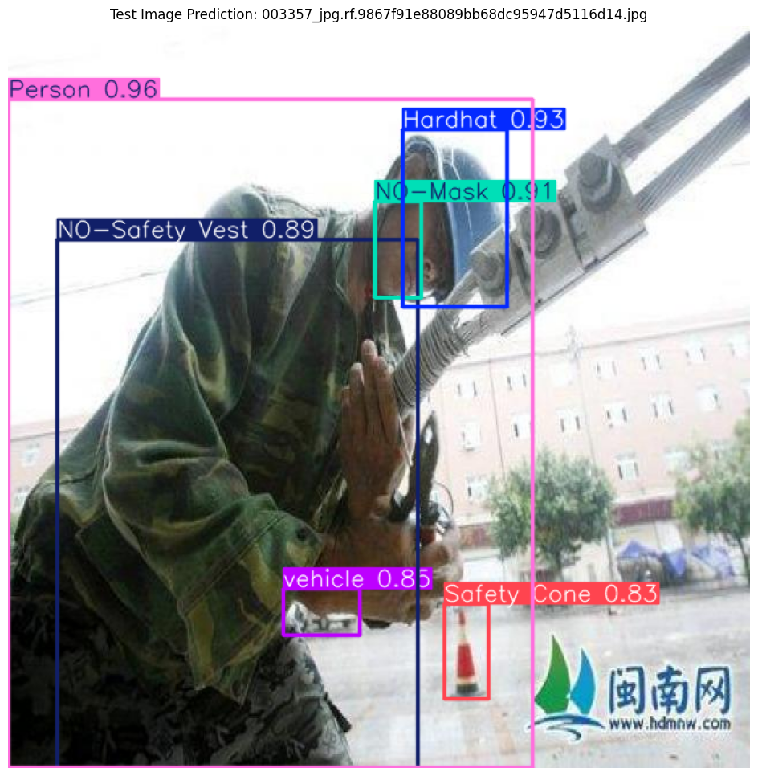

# Building Safer Sites: Object Detection for Safety Compliance on Construction Sites

**By: Young Woo Song**  
*(See [References](#references) below for notebooks and further details.)*

## Table of Contents
1. [Overview](#overview)
2. [Sample Images & Video Placeholder](#sample-images--video-placeholder)
3. [Problem Statement](#problem-statement)
4. [Industry/Domain](#industrydomain)
5. [Stakeholders](#stakeholders)
6. [Business and Data Questions](#business-and-data-questions)
7. [Data Description](#data-description)
8. [Data Science Process](#data-science-process)
9. [Modeling and Evaluation](#modeling-and-evaluation)
10. [Implementation and Results](#implementation-and-results)
11. [Business and Data Answers](#business-and-data-answers)
12. [References](#references)

---

## Overview 
- **Presentation:** [Click here](https://docs.google.com/presentation/d/1dqKrkC93hJaZuHbiYrfXxdaZGDl-4SeXTTZ4rKVp44w/pub?start=false&loop=false&delayms=3000)
- **Full Report:** [Click here](https://docs.google.com/document/d/e/2PACX-1vTrURLXikE6d2WMttfvWha5lRz4AbbcjGErVmp2-7c2o6KevnptmiShxyBagpeYQg/pub)

Additional Resources:
- [Tested Images](./Tested_Images)
- [Tested Videos (Object Tracking / Webcam Inference)](./Tested_Video)
- [YOLO Model with Normalization Performance](./YOLO_70_epochs_w_normalisation_Results)
- [YOLO Model with Oversampling Performance](./YOLO_50_epochs_w_Oversampling_Results)

---

## Sample Test Images

Below are a few **sample detection outputs** from the `Tested_Images` folder. Each output image demonstrates how the model identifies and classifies Personal Protective Equipment (PPE). For the full set, visit the [Tested Images folder](./Tested_Images).

 

**1. Output (output.png)**  
  
*Model detecting workers and PPE (helmets, vests, etc.).*

 

**2. Output (output2.png)**  
  
*Another detection result with bounding boxes around identified PPE.*

 

**3. Output (output3.png)**  
  
*Model inference showing multiple workers; color-coded bounding boxes for each class.*

 

### GIF Demo
Below is a **short demo** showing the object detection & tracking process in action:

*Real-time detection of workers and their PPE in a construction environment.*

---

## Problem Statement 
Currently in New Zealand, construction site safety is often monitored manually, which can be **time-consuming** and **error-prone**, leading to **increased risk of accidents** and potential **legal liabilities**.

**Value Proposition**:
- Automating safety compliance checks can reduce accidents, injuries, and associated costs by ensuring workers wear proper PPE on-site.

This project aims to **detect safety compliance** items (like PPE gear) via object detection, using labeled image data to identify whether workers are wearing proper safety equipment.

---

## Industry/Domain 
- **Focus**: Construction industry, specifically site safety.
- **Context**: High-risk environment, where monitoring worker compliance is crucial.
- **Application**: Relevant to any industry requiring PPE (e.g., manufacturing, mining, oil & gas).

---

## Stakeholders 
- **Key Stakeholders**: Construction company executives, regulatory bodies, site managers, safety officers  
- **Goal**: Mitigate accidents, legal liabilities, and cost through proactive monitoring.

---

## Business and Data Questions 
- **Business Question**: How can we efficiently detect safety compliance at construction sites using object detection and tracking?
- **Data Question**: What data features are required for an accurate model that identifies safety gear on construction sites?

---

## Data Description 
- **Source**: [Kaggle Construction Site Safety Image Dataset](https://www.kaggle.com/datasets/snehilsanyal/construction-site-safety-image-dataset-roboflow/data)
- **Details**:
  - Images labeled for various PPE (helmets, vests, etc.).
  - Diverse set of construction scenarios with bounding-box annotations.
  - Ongoing data collection can further improve the model.

---

## Data Science Process 
- **Data Analysis**:
  - Checked image sizes (640x640) for consistency.
  - Label distribution showed imbalance (the “Person” class being most frequent).

---

## Modeling and Evaluation 
- **Model Choice**: YOLOv9 for efficient object detection.
- **Improvement Stages**:
  1. Baseline YOLO Model  
  2. YOLO with Normalization  
  3. YOLO with Oversampling and Normalization
- **Evaluation**:
  - The YOLO model with normalization gave the best balance of **precision** and **recall**.

---

## Implementation and Results 
- **Implementation Considerations**:
  - Real-time object tracking performance.
  - Data collection strategies for continuous model improvement.
  - Deployment environment and associated costs.
- **Outcomes**:
  - Demonstrated strong detection of safety gear with YOLO.
  - High precision in identifying key PPE classes (helmets, vests, etc.).

---

## Business and Data Answers 
- **Data Answer**: The labeled images effectively trained an accurate detection model.  
- **Business Answer**: A robust, real-time compliance check can reduce accidents, costs, and liabilities in the construction sector.  
- **Next Steps**: Real-world pilot testing, continued data collection, and further model refinement.

---

## References 
1. **Notebooks (Code)**
   - [CSS_Image_detection_Inspection.ipynb](./CSS_Image_detection_Inspection.ipynb) – Dataset inspection and analysis  
   - [Final_YOLO_Model_50_epochs_ovs_norm.ipynb](./Final_YOLO_Model_50_epochs_ovs_norm.ipynb) – YOLO with Oversampling & Normalization (50 epochs)  
   - [Final_YOLO_Model_70_epochs_norm.ipynb](./Final_YOLO_Model_70_epochs_norm.ipynb) – YOLO with Oversampling & Normalization (70 epochs)  
   - [Webcam_Inference.py](./Webcam_Inference.py) – Deployment code for local webcam inference

2. **Image Sources and Additional Info**  
   - [Digital Transformation in Construction Industry](https://www.slideshare.net/slideshow/digital-transformation-in-the-construction-industry/98665953)  
   - [WorkSafe NZ Injury Data](https://data.worksafe.govt.nz/graph/detail/injuries_week_away?startDate=2022-01&endDate=2023-05&industry=Construction)  
   - [Vital PPE Gear for Construction](https://safetysupplies.co.nz/blogs/news/vital-ppe-gear-for-ensuring-safety-in-construction)  
   - [Serious Harm Injuries Data](https://data.worksafe.govt.nz/graph/summary/injuries_serious_harm)  
   - [PPE Practical Safety Advice](https://www.sitesafe.org.nz/globalassets/guides-and-resources/practical-safety-advice/ppe_2019-web.pdf)
   - [Construction Site Safety Dataset](https://www.kaggle.com/datasets/snehilsanyal/construction-site-safety-image-dataset-roboflow/data)
